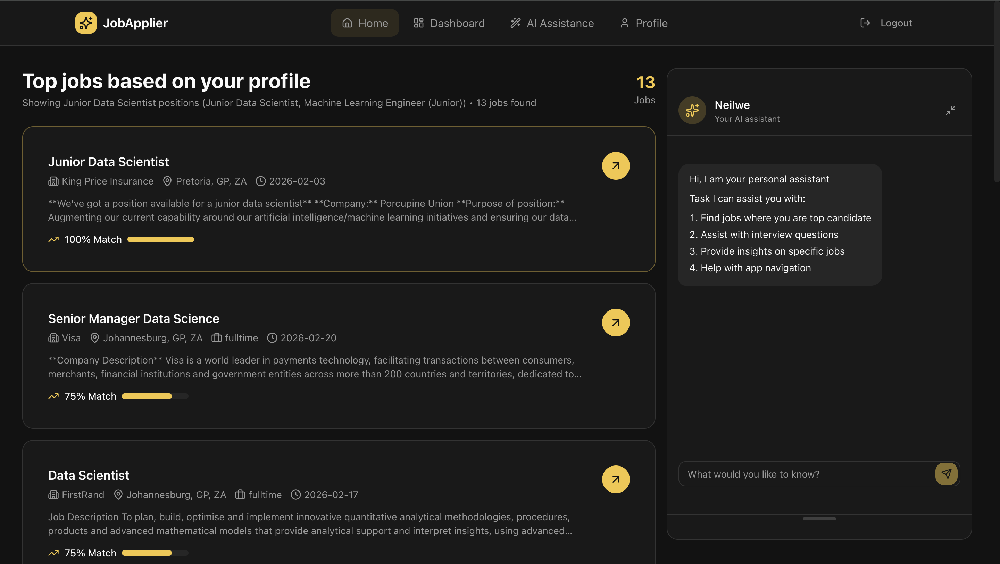
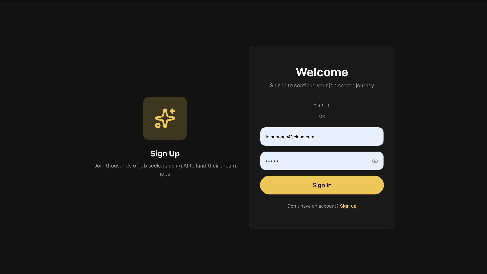
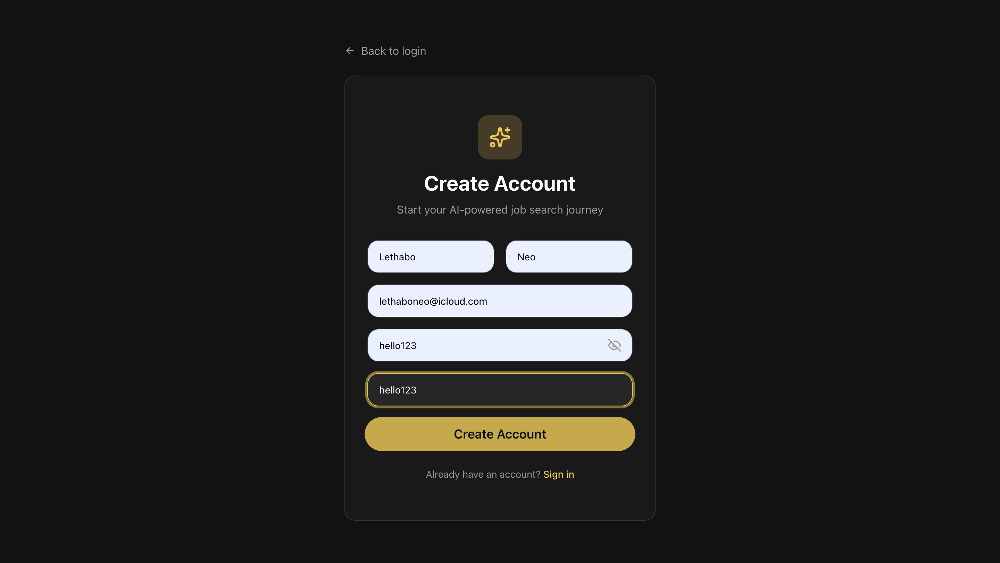
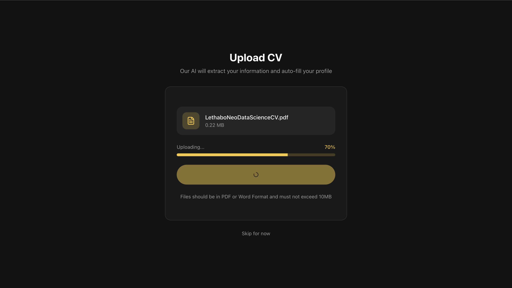
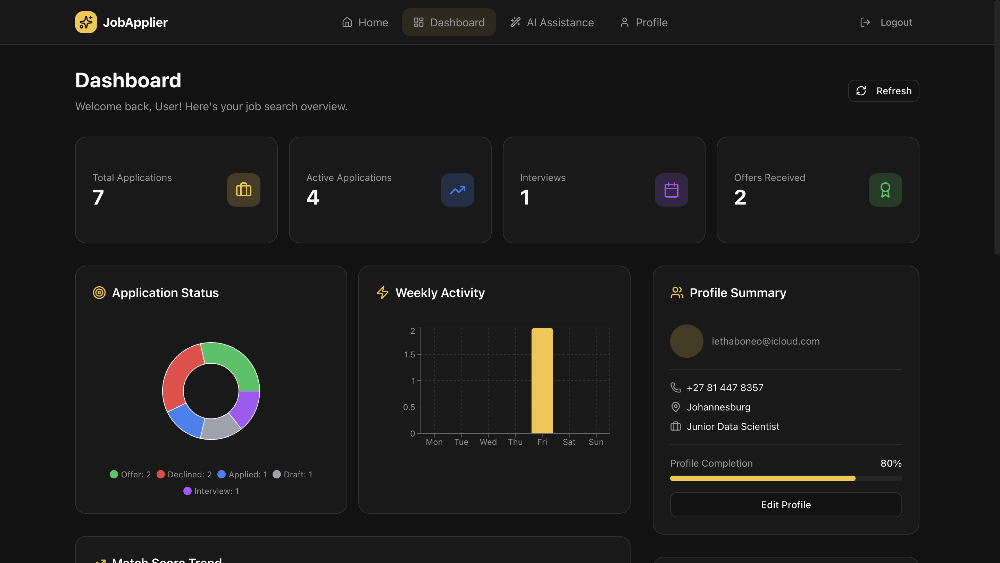
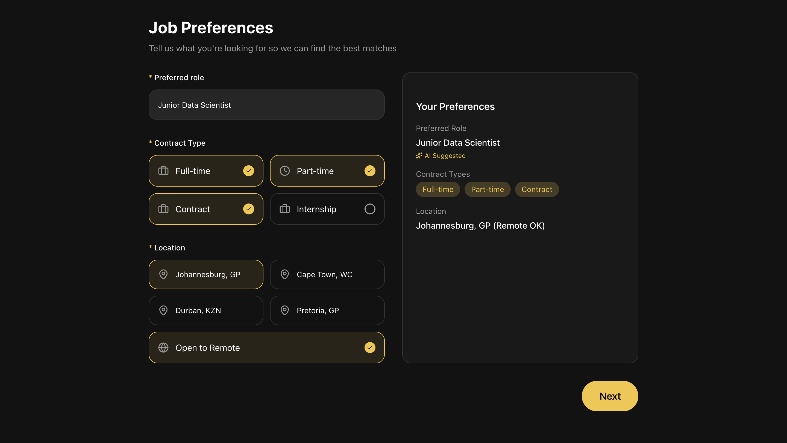
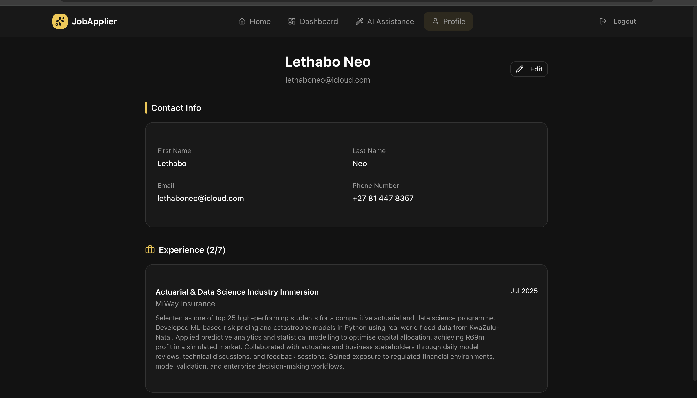
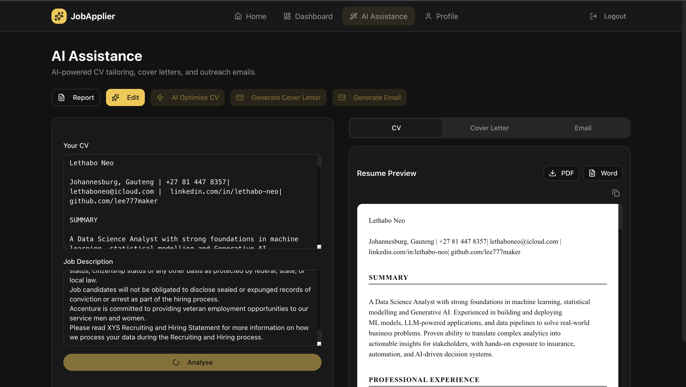
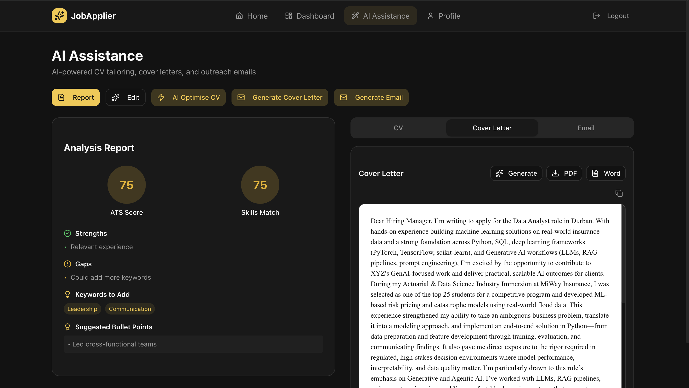
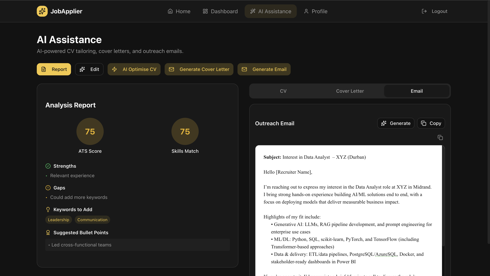

# JobApplier AI 🤖

<p align="center">
  
</p>

<p align="center">
  
  
  
  
  
  
  
  
</p>

<p align="center">
  <b>AI-Powered Job Application Assistant for South African Job Seekers</b><br>
  Automate your job search with intelligent resume tailoring, ATS optimization, live job listings, career coaching and personalised cover letters.
</p>

<p align="center">
  <a href="https://discord.com/channels/1466486232027500815/1466486232585470163">
    
  </a>
  <a href="https://www.linkedin.com/in/lethabo-neo/">
    
  </a>
</p>

---

## What Is This?

JobApplier AI is an end-to-end job application assistant that reduces the time you spend on repetitive job search tasks from hours to minutes. Upload your CV once, set your preferences, and let AI handle the tailoring, scoring, cover letter writing, and motivation scripting for every application.

**Current status:** Beta (v3) — core features working, some agents still in active development.

---

## Key Features

| Feature | Description | Status |
|---------|-------------|--------|
| **Live Job Listings** | Real jobs from Indeed & LinkedIn, filtered to South Africa (last 30 days) | ✅ Working |
| **CV Intelligence** | Upload PDF/DOCX — AI auto-extracts skills, experience, education, and certifications | 90% Compelete |
| **ATS Score** | Match score + missing keyword recommendations for any job posting | 90% Complete |
| **Cover Letter Generator** | Tailored cover letters in seconds from your profile + job description | 80% Complete |
| **CV Tailoring** | AI rewrites your CV to align with a specific job | 90% Complete |
| **AI Coach (Neilwe)** | Personal AI career coach for job search strategy | 80% Complete |
| **Dashboard Analytics** | Application tracking and match score history | 40% Complete |
| **Application Tracker** | Track applications with status, notes, and outcomes | 50% Complete |
| **News Insights** | News panel to keep dated with career insights | 📋 Planned |
| **Auto-Application** | Automatically submit applications on your behalf | 📋 Planned |
| **Mobile App** | React Native companion app | 📋 Planned |

_'Status' is based on production level readiness. All features work in development phase apart from features with "Planned" status_

---

## Screenshots

<p align="center">
  
  
  
</p>

<p align="center">
  
  
  
</p>

<p align="center">
  
  
  
</p>

---

## Architecture

```
┌─────────────────┐     ┌─────────────────┐     ┌─────────────────┐
│   Frontend      │────▶│    Backend      │────▶│   AI Service    │
│   React 18      │◀────│  Spring Boot 3  │◀────│   FastAPI       │
│   :5173         │     │  :8080          │     │   :8001         │
└─────────────────┘     └────────┬────────┘     └─────────────────┘
                                 │
                    ┌────────────┼────────────┐
                    │            │            │
             ┌──────▼──┐  ┌─────▼─────┐  ┌──▼──────┐
             │ JobSpy  │  │PostgreSQL │  │  Redis  │
             │ :8002   │  │  :5432    │  │  :6379  │
             └─────────┘  └───────────┘  └─────────┘
```

### Tech Stack

| Layer | Technology |
|-------|------------|
| **Frontend** | React 18 + TypeScript + Vite + Tailwind CSS + shadcn/ui |
| **Backend** | Spring Boot 3.2 + Java 21 + Spring Security (Argon2) + JPA/Hibernate |
| **AI Service** | Python 3.11 + FastAPI + OpenAI GPT-5 + Sentence Transformers + PDFMiner |
| **Job Scraping** | JobSpy (Indeed primary, LinkedIn backup) — South Africa focused |
| **News API** | NewsData.io — Career and South African focused |
| **Database** | PostgreSQL 15 (production) / H2 (development) |
| **Cache** | Redis 7 (session management) |
| **Deployment** | Docker Compose |

---

## Quick Start

### Prerequisites

- Docker & Docker Compose *(recommended)*  
  OR: Java 21 + Maven, Python 3.11, Node.js 18+, OpenAI API key

### Docker (Easiest)

```bash
# 1. Clone
git clone https://github.com/yourusername/jobapplier-ai.git
cd jobapplier-ai

# 2. Set environment variables
cp .env.example .env
# Edit .env with your values:
#   OPENAI_API_KEY=sk-your-key-here
#   DB_PASSWORD=yourpassword
#   JWT_SECRET=yoursecret

# 3. Start all services
docker-compose up --build

# 4. Open the app
open http://localhost:5173
```

### Access Points

| Service | URL |
|---------|-----|
| Frontend | http://localhost:5173 |
| Backend API | http://localhost:8080 |
| AI Service | http://localhost:8001 |
| JobSpy | http://localhost:8002 |

---

## API Reference

### AI Service (:8001)

| Endpoint | Method | Description |
|----------|--------|-------------|
| `/agents/neilwe-chat` | POST | Chat with AI career coach |
| `/agents/match-score` | POST | Calculate ATS match score |
| `/agents/tailor-resume` | POST | Tailor resume for job posting |
| `/agents/generate-cover-letter` | POST | Generate personalised cover letter |
| `/agents/generate-email` | POST | Generate outreach email |
| `/agents/extract-cv` | POST | Parse and extract CV data (PDF/DOCX) |
| `/agents/autofill` | POST | Autofill from CV text |
| `/agents/extract-job-titles` | POST | Extract job titles from CV |
| `/health` | GET | Health check |

### JobSpy Service (:8002)

| Endpoint | Method | Description |
|----------|--------|-------------|
| `/search` | POST | Search Indeed/LinkedIn jobs |
| `/search-by-profile` | POST | Search using full user profile |
| `/health` | GET | Health check |

### Backend (:8080)

| Endpoint | Method | Description |
|----------|--------|-------------|
| `/api/auth/register` | POST | Register new user |
| `/api/auth/login` | POST | Login |
| `/api/profile/{userId}` | GET/PUT | User profile management |
| `/api/jobs/recommendations/{userId}` | GET | Personalised job recommendations |
| `/api/jobs/search-by-profile` | POST | Search jobs by profile |
| `/api/applications` | POST | Create application |
| `/api/applications/user/{userId}` | GET | Get user applications |
| `/api/dashboard/**` | Various | Dashboard analytics |
| `/api/ai/**` | Various | Proxy to AI service |

---

## Configuration

Copy `.env.example` and fill in your values:

```env
OPENAI_API_KEY=sk-your-key-here
DB_PASSWORD=your-postgres-password
JWT_SECRET=your-jwt-secret-key
AI_SERVICE_URL=http://ai-service:8001        # default
JOBSPY_SERVICE_URL=http://jobspy-service:8002 # default
CORS_ALLOWED_ORIGINS=http://localhost:5173    # add production domain
```

To switch to PostgreSQL for local dev, set:
```
SPRING_PROFILES_ACTIVE=prod
```

---

## Testing

```bash
# AI Service
cd ai-service && pytest tests/

# Backend
cd backend && ./mvnw test

# Frontend
cd frontend && npm test

# Manual: Test job scraper
curl -X POST http://localhost:8002/search \
  -H "Content-Type: application/json" \
  -d '{"keyword":"software engineer","location":"Johannesburg","max_results":5,"days_old":30}'
```

---

## Project Structure

```
jobapplier-ai/
├── frontend/                 # React + TypeScript + Vite
│   ├── src/
│   │   ├── components/       # UI components (shadcn/ui)
│   │   ├── context/          # React context (AppContext)
│   │   ├── lib/              # API clients, utilities
│   │   ├── pages/            # Page components
│   │   └── types/            # TypeScript types
│   └── package.json
|   └── Dockerfile
├── backend/                  # Spring Boot 3.2
│   ├── src/main/java/
│   │   └── jobapplier/
│   │       ├── api/          # REST controllers
│   │       ├── config/       # Security, App config
│   │       ├── model/        # JPA entities
│   │       ├── repository/   # Spring Data JPA
│   │       └── service/      # Business logic
│   └── pom.xml
|   └── Dockerfile
├── ai-service/               # Python FastAPI
│   ├── app.py                # Main FastAPI app
│   ├── requirements.txt
│   └── Dockerfile
├── jobspy-service/           # Job scraping service
│   ├── jobspy_service.py
│   ├── requirements.txt
│   └── Dockerfile
├── docs/                     # Documentation
│   ├── Architecture-Overview.md
│   ├── Product-Specification.md
│   ├── Testing-Strategy.md
│   └── Design-Decisions.md
├── docker-compose.yml
└── README.md
```

---

## Roadmap

- [x] User authentication & profiles
- [x] CV upload & AI extraction
- [x] ATS match scoring
- [x] Cover letter generation
- [x] Live job listings (Indeed)
- [x] Resume tailoring
- [x] AI Coach (Neilwe)
- [x] Application tracking
- [x] Dashboard analytics
- [ ] News insights integration
- [ ] LinkedIn job integration
- [ ] Email notifications
- [ ] Interview preparation module
- [ ] Automated application submission
- [ ] Mobile app (React Native)
- [ ] POPIA compliance audit

---

## Documentation

- [Architecture Overview](docs/Architecture-Overview.md) - System architecture and design (Still in progress)
- [Product Specification](docs/Product-Specification.md) - Feature requirements and specifications
- [Testing Strategy](docs/Testing-Strategy.md) - Testing approach and test plans
- [Design Decisions](docs/Design-Decisions.md) - Key technical decisions and rationale (Still in progress)

---

## Contributing

1. Fork the repository
2. Create a feature branch: `git checkout -b feature/your-feature`
3. Commit your changes: `git commit -m 'Add your feature'`
4. Push to the branch: `git push origin feature/your-feature`
5. Open a Pull Request

Please read [CONTRIBUTING.md](docs/CONTRIBUTING.md) for more details.

---

## License

MIT License — see [LICENSE](docs/LICENSE) for details.

---

## Acknowledgments

- [OpenAI](https://openai.com/) for GPT-5 API
- [JobSpy](https://github.com/speedyapply/JobSpy) for job scraping
- [shadcn/ui](https://ui.shadcn.com/) for UI components
- [Spring Boot](https://spring.io/projects/spring-boot) for backend framework

---

<p align="center">Made with ❤️ for job seekers everywhere · <a href="https://discord.com/channels/1466486232027500815">Join the community</a></p>
