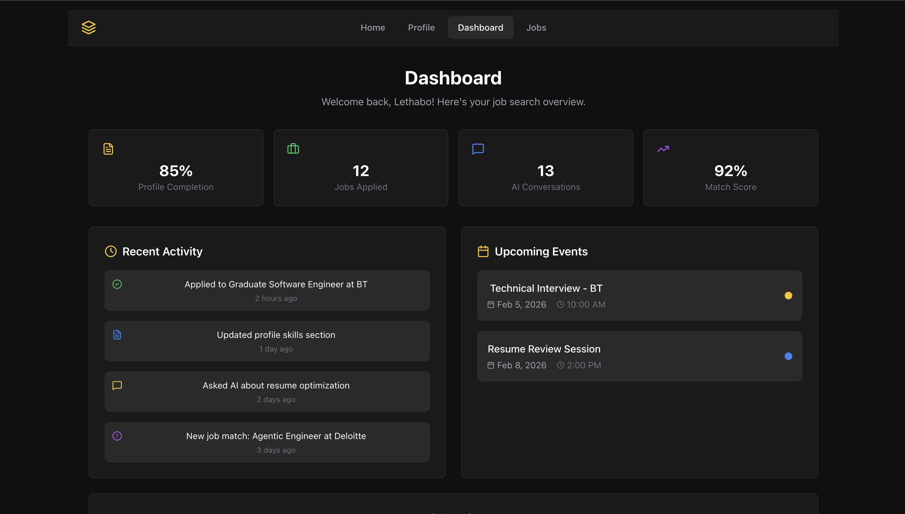
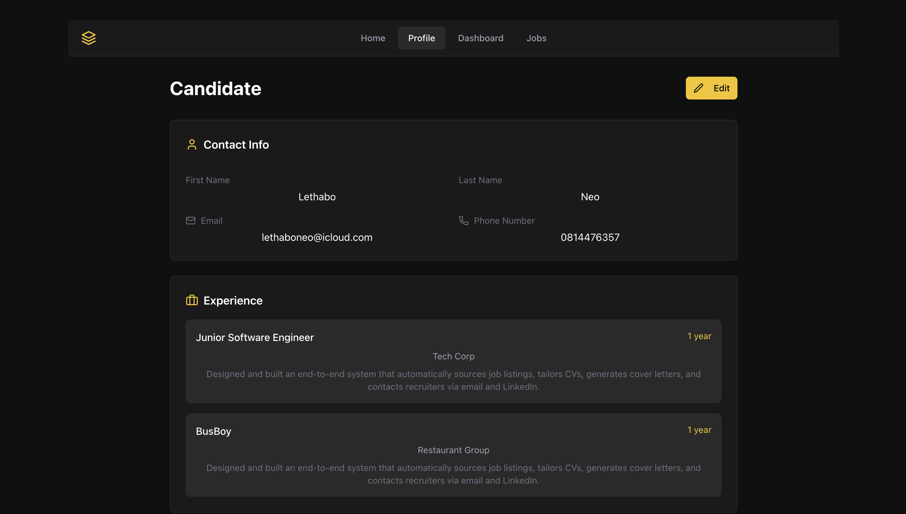
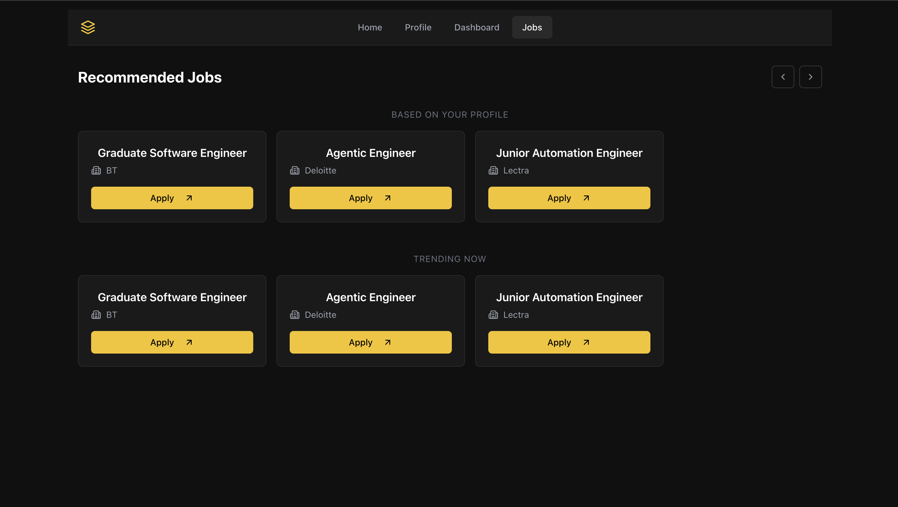

# AI Automated Job Applier
<p align="center">
  
</p>

## JobApplier AI

<p align="center">
  
  
  
  
  
  
</p>

<p align="center">
  <b>AI-Powered Job Application Assistant</b><br>
  Automate your job search with intelligent resume tailoring, ATS optimization, and personalized cover letters.
</p>

<h4 align="center">
  <a href="https://discord.com/channels/1466486232027500815/1466486232585470163">
    
  </a>
  <a href="https://www.linkedin.com/in/lethabo-neo/">
    
  </a>
</h4>

## Introduction

This system streamlines job applications by leveraging AI to:
- Tailor CV based on **experience, education, skills, projects**
- Generate **custom cover letters** from job descriptions and personal information
- Recommend relevant jobs automatically
- Message recruiters and LinkedIn connections
- Reduce repetitive manual work end-to-end
  
This happens seamlessly and intelligently, adapting as it learns more about you.
<details open>
<p align="center">
  
</p>
<p align="center">
  
</p>
</details>

## Features

- **AI Chat Assistant** - Natural language interface for job search assistance
- **Resume Analysis** - Upload and parse PDF, DOCX, and TXT resumes
- **ATS Match Scoring** - Get detailed compatibility scores with job descriptions
- **Resume Tailoring** - AI-optimized resumes tailored to specific job postings
- **Cover Letter Generation** - Personalized cover letters in seconds
- **Job Recommendations** - Smart job matching based on your profile
- **Profile Management** - Complete profile with experience, education, skills, and certifications
- **Dashboard Analytics** - Track applications, conversations, and match scores

## Tech Stack

### Frontend
- **React 18** with TypeScript
- **Tailwind CSS** for styling
- **shadcn/ui** component library
- **Vite** for fast development

### Backend
- **Spring Boot 3** - Main API and business logic
- **Java 17** - Modern Java features
- **Argon2** - Secure password hashing
- **JPA/JDBC** - Data persistence

### AI Service
- **Python 3.11** with FastAPI
- **OpenAI GPT-4** - Language model integration
- **Sentence Transformers** - Semantic similarity matching
- **PDFMiner & python-docx** - Document parsing


> ⚠️ This is an **early prototype**. Many agents are still under active development.

## Usage 
You can run the project locally for testing and exploration.

**Disclaimer:**  
Run at your own risk — this is an experimental prototype.

## Pre-requisites
- Node.js 18+ and npm
- Java 17+ and Maven
- Python 3.11+
- OpenAI API key

## Run locally
1. **Clone the repository**
   ```bash
   git clone https://github.com/yourusername/jobapplier-ai.git
   cd jobapplier-ai
   ```

2. **Set up environment variables**
   ```bash
   # Create .env file in ai-service/
   echo "OPENAI_API_KEY=your_api_key_here" > ai-service/.env
   ```

3. **Start all services**
   ```bash
   ./start.sh dev
   ```

   Or start services individually:
   ```bash
   # Frontend
   cd frontend && npm install && npm run dev

   # Backend
   cd backend && ./mvnw spring-boot:run

   # AI Service
   cd ai-service && python -m venv .venv
   source .venv/bin/activate
   pip install -r requirements.txt
   python run.py
   ```

4. **Access the application**
   - Frontend: http://localhost:5173
   - Backend API: http://localhost:8080
   - AI Service: http://localhost:8001
## Future work

## Usage

### Getting Started
1. **Upload Your Resume**
   - Click the paperclip icon in the chat
   - Upload PDF, DOCX, or TXT files
   - The AI will extract skills and content

2. **Paste Job Description**
   - Copy a job posting into the chat
   - The AI automatically detects job descriptions

3. **Ask for Help**
   - "Tailor my resume for this job"
   - "What's my ATS match score?"
   - "Generate a cover letter"

### Example Commands

```
"Tailor my CV for this position"
"Calculate my match score"
"Write a cover letter for Deloitte"
"What skills am I missing?"
"Optimize my resume for ATS"
```
## Architecture

```
┌─────────────────┐     ┌─────────────────┐     ┌─────────────────┐
│   Frontend      │────▶│    Backend      │────▶│   AI Service    │
│   (React)       │◄────│  (Spring Boot)  │◄────│   (FastAPI)     │
│                 │     │                 │     │                 │
│ • Chat UI       │     │ • REST API      │     │ • GPT-4         │
│ • Profile       │     │ • Auth          │     │ • Embeddings    │
│ • Dashboard     │     │ • Job Mgmt      │     │ • Resume Parser │
└─────────────────┘     └─────────────────┘     └─────────────────┘
         │                       │                       │
         └───────────────────────┴───────────────────────┘
                              │
                    ┌─────────────────┐
                    │   PostgreSQL    │
                    │   (Optional)    │
                    └─────────────────┘
```

## API Endpoints

### AI Service (`/api/ai`)
| Endpoint | Method | Description |
|----------|--------|-------------|
| `/chat` | POST | General AI chat |
| `/match-score` | POST | Calculate job match score |
| `/tailor-resume` | POST | Tailor resume for job |
| `/generate-cover-letter` | POST | Generate cover letter |
| `/upload-resume` | POST | Parse resume file |
| `/health` | GET | Health check |

### Jobs (`/api/jobs`)
| Endpoint | Method | Description |
|----------|--------|-------------|
| `/recommendations/{userId}` | GET | Get job recommendations |
| `/` | POST | Create new job |
| `/search` | GET | Search jobs |

## Project Structure

```
jobapplier-ai/
├── frontend/           # React TypeScript frontend
│   ├── src/
│   │   ├── components/ # UI components
│   │   ├── pages/      # Page components
│   │   ├── context/    # React context
│   │   └── types/      # TypeScript types
│   └── package.json
├── backend/            # Spring Boot backend
│   └── src/main/java/jobapplier/
│       ├── api/        # REST controllers
│       ├── model/      # Domain models
│       ├── repository/ # Data access
│       └── config/     # Configuration
├── ai-service/         # Python AI microservice
│   ├── app.py          # FastAPI application
│   ├── requirements.txt
│   └── tests/
├── logs/               # Service logs
└── start.sh            # Startup script
```

## Configuration

### Environment Variables

| Variable | Description | Default |
|----------|-------------|---------|
| `OPENAI_API_KEY` | OpenAI API key | Required |
| `AI_SERVICE_URL` | AI service endpoint | http://localhost:8001 |
| `CORS_ALLOWED_ORIGINS` | CORS origins | * |

### Frontend (.env)
```env
VITE_API_URL=http://localhost:8080
```

## Testing

```bash
# Run all tests
./start.sh test

# AI Service tests
cd ai-service && pytest tests/

# Backend tests
cd backend && ./mvnw test

# Frontend tests
cd frontend && npm test
```

## Docker Deployment

```bash
# Build and run with Docker Compose
docker-compose up --build

# Or use the start script
./start.sh docker
```

## Contributing

1. Fork the repository
2. Create a feature branch (`git checkout -b feature/amazing-feature`)
3. Commit your changes (`git commit -m 'Add amazing feature'`)
4. Push to the branch (`git push origin feature/amazing-feature`)
5. Open a Pull Request
Please read [CONTRIBUTING.md](docs/CONTRIBUTING.md) for more details.

## Roadmap

- [ ] LinkedIn integration for job import
- [ ] Automated job application submissions
- [ ] Interview scheduling and reminders
- [ ] Multi-language support
- [ ] Mobile app (React Native)
- [ ] Advanced analytics dashboard
- [ ] Team/collaboration features

## License

This project is licensed under the MIT License - see the [LICENSE](LICENSE) file for details.

## Acknowledgments

- [OpenAI](https://openai.com/) for GPT-4 API
- [Sentence Transformers](https://www.sbert.net/) for semantic matching
- [shadcn/ui](https://ui.shadcn.com/) for beautiful UI components

<p align="center">
  Made with ❤️ for job seekers everywhere
</p>
